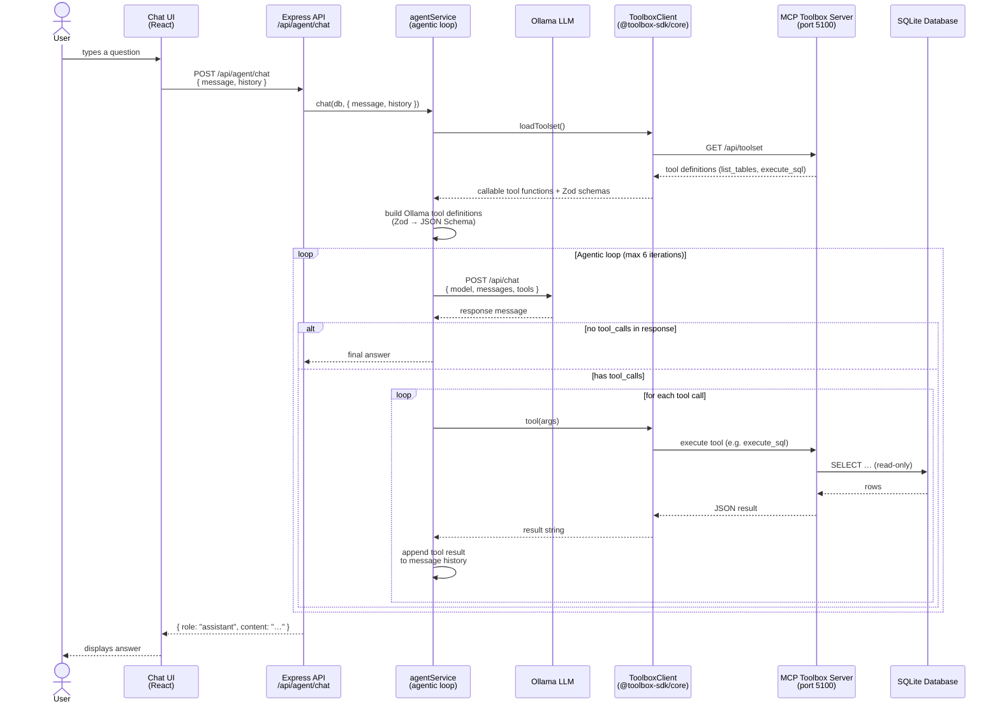

# ProjectsTracker

A full-stack project management application with budget tracking, vendor management, and delivery path planning. And soon, architecture management.

## Stack

- **Frontend**: React 19 + Vite + TailwindCSS
- **Backend**: Node.js 20 + Express.js
- **Database**: SQLite3 (WAL mode for concurrent access)
- **Auth**: JWT + HttpOnly Cookies
- **Deployment**: Docker + Docker Compose

## Quick Start

### With Docker (Recommended for Deployment)

```bash
# Setup environment
cp .env.docker.sample .env

# Build and run
docker compose up --build -d

# Access at http://localhost
```

Default login: `admin@projecttracker.it` / `adminpassword`

See [DOCKER.md](./DOCKER.md) for detailed Docker instructions.

### Local Development (Without Docker)

**Backend:**
```bash
cd backend
npm install
npm start  # runs on http://localhost:5000
```

**Frontend:**
```bash
cd frontend
npm install
npm run dev  # runs on http://localhost:5173
```

See [CLAUDE.md](./CLAUDE.md) for development guidelines.

## Documentation

- **[DOCKER.md](./DOCKER.md)** — Docker setup, commands, and troubleshooting
- **[DEPLOYMENT.md](./DEPLOYMENT.md)** — Production deployment (systemd, PM2, reverse proxy)
- **[CLAUDE.md](./CLAUDE.md)** — Development guidelines, testing, and architecture

## Features

- User authentication with role-based access control
- Project and budget management
- Vendor and purchase order tracking
- Division and initiative planning
- Delivery path milestones with timeline visualization
- Supporting divisions for projects
- Activity logging
- AI assistant for natural-language database queries (via Ollama + MCP Toolbox)

## AI Assistant

The AI assistant lets users ask questions about their data in plain English ("Which projects are at risk?", "What is the total budget for Division X?"). It uses a local or cloud Ollama LLM and the [MCP Toolbox for Databases](https://github.com/googleapis/mcp-toolbox) to safely execute read-only SQL against the SQLite database.

### How It Works



### Components

| Component | Role |
|-----------|------|
| `@toolbox-sdk/server` | MCP Toolbox server spawned by the backend on startup (port 5100). Exposes `list_tables` and `execute_sql` tools backed by the SQLite database. Only SELECT queries are permitted. |
| `@toolbox-sdk/core` | Client SDK used inside `agentService.js` to discover available tools and call them. |
| Ollama | LLM backend. Receives the conversation history + tool definitions on each iteration and decides whether to answer directly or invoke a tool. |
| `agentService.js` | Orchestrates the agentic loop — up to 6 LLM calls, feeding each tool result back into the conversation until Ollama stops requesting tools. |

### Configuration

Admins and superadmins can configure the Ollama connection under **Settings → AI Agent**:

| Setting | Description |
|---------|-------------|
| Ollama URL | Base URL of your Ollama server (default: `http://localhost:11434`) |
| Model | Select from models available on your Ollama instance, or type a name manually |
| API Key | Bearer token for [Ollama cloud](https://ollama.com/blog/ollama-cloud) — leave empty for local |

### Prerequisites

The AI assistant requires a running Ollama instance with at least one model pulled:

```bash
# Install Ollama (macOS)
brew install ollama

# Pull a model
ollama pull llama3.2

# Start Ollama (if not already running)
ollama serve
```

The MCP Toolbox server starts automatically alongside the backend — no separate setup is needed.

## Database Initialization

On first run, the backend automatically:
1. Creates/initializes the SQLite database
2. Runs all migrations from `backend/migrations/`
3. Seeds default user roles
4. Seeds default user accounts (if empty)
5. Seeds countries (UN M49 list, 196 entries)
6. Seeds sample/dummy data

### Startup Modes

| Command | Roles | Users | Countries | Dummy Data |
|---------|-------|-------|-----------|------------|
| `node index.js` | ✓ | ✓ | ✓ | ✓ |
| `node index.js nodata` | ✓ | ✓ | ✓ | ✗ |

Use `nodata` for clean production deployments where you want only the essential data without sample projects, budgets, vendors, and other demo content:

```bash
node index.js nodata
```

With PM2, pass it via the ecosystem config:
```js
// ecosystem.config.js
args: 'nodata'
```

Default credentials can be found in [CLAUDE.md](./CLAUDE.md#default-credentials).

## Testing

### Backend Unit & Integration Tests

```bash
cd backend
npm test               # run all tests with coverage
npm run test:watch     # watch mode
```

### Frontend E2E Tests (Playwright)

E2E tests run against a real backend + frontend. Playwright auto-starts both servers.

```bash
cd frontend
npm run test:e2e           # headless (CI-friendly)
npm run test:e2e:headed    # visible browser window
```

**Prerequisites:** First-time setup requires installing the Chromium browser:

```bash
cd frontend
npx playwright install chromium
```

**What's tested:** Authentication (login/logout, role-based access), navigation, projects (list, detail, vendor resources), vendors, and role-based UI visibility across 38 tests.

## Environment Configuration

- **Development**: Copy `.env.sample` files in `backend/` and `frontend/`
- **Docker**: Copy `.env.docker.sample` to `.env` in the project root

## Security

- Passwords hashed with bcryptjs
- JWT tokens stored in HttpOnly cookies (XSS protection)
- CORS configured for frontend origin
- Helmet.js for HTTP security headers
- SQLite with foreign keys enforced

## Support

For issues or questions, check the troubleshooting sections in [DOCKER.md](./DOCKER.md) or [DEPLOYMENT.md](./DEPLOYMENT.md).
